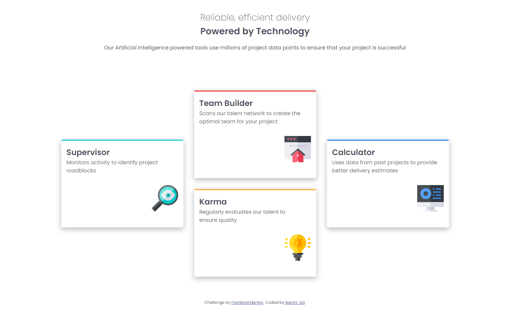

# Frontend Mentor - Four card feature section solution

This is a solution to the [Four card feature section challenge on Frontend Mentor](https://www.frontendmentor.io/challenges/four-card-feature-section-weK1eFYK). Frontend Mentor challenges help you improve your coding skills by building realistic projects. 

## Table of contents

- [Overview](#overview)
  - [The challenge](#the-challenge)
  - [Screenshot](#screenshot)
  - [Links](#links)
- [My process](#my-process)
  - [Built with](#built-with)
  - [What I learned](#what-i-learned)
  - [Continued development](#continued-development)
  - [Useful resources](#useful-resources)
- [Author](#author)

## Overview

### The challenge

Users should be able to:

- View the optimal layout for the site depending on their device's screen size

### Screenshot




### Links

- Solution URL: [Add solution URL here](https://your-solution-url.com)
- Live Site URL: [Add live site URL here](https://your-live-site-url.com)

## My process

### Built with

- Semantic HTML5 markup
- CSS custom properties
- Flexbox
- CSS Grid
- Mobile-first workflow
- Sass

### What I learned

This project pushed me to the edge in learning a new css pre-prcessor like Sass. I also helped me go in depth in building flexible layout. I learnt new and facinating things about the flexbox and the grid layouts.

Here's a Sass I'm proud of,

```scss
@mixin display-flex ($flex-direction, $justify-contents, $align-items) {
    display: flex;
    flex-direction: $flex-direction;
    justify-content: $justify-contents;
    align-items: $align-items; 
} 
```

Note: Ive never used Sass before so been able to write this after watching a youtube tutorial was a real joy for me. I had to event celebrate it with a dance :dancer: :laughing: (even the emoji was a new thing i learned in this project :smile:). You can check it out [HERE](https://dev.to/nikolab/complete-list-of-github-markdown-emoji-markup-5aia)


### Continued development

I want to continue to learn more on building flexible layouts. Getting to know more about how to let my browser do the heavy lifting in order to create fluid layouts without any hustle. Thus making my life easier and making my website more robust and responsive. I also want to improve on my Sass journey (i.e learn more about it) in order to get the hang of it. I want to write good Sass codes in order to leverag its power to my advantage.


### Useful resources

- [An Interactive Guide to CSS Grid](https://www.joshwcomeau.com/css/interactive-guide-to-grid/) - This article by Josh really explained CSS Grid in details. With some cool features like the perspective view, and on-site code playground, I had a clear picture of what what css grid is all about and I also got a little bit of a hands-on experience on the page. I'd reccommend His articles to any new developer out there.

- [Flexbox Froggy](https://flexboxfroggy.com/) - This fun game helped me put my css flexbox knowledge to the test. I'd recomend this to anyone who thinks they know their stuff (Flexbox).


## Author

- Github - [@Banini-AD](https://www.github.com/Banini-AD)
- Frontend Mentor - [@Banini-AD](https://www.frontendmentor.io/profile/Banini-AD)
- Discord - [@Banini-AD](https://discord.gg/dk9Aj3CU)
